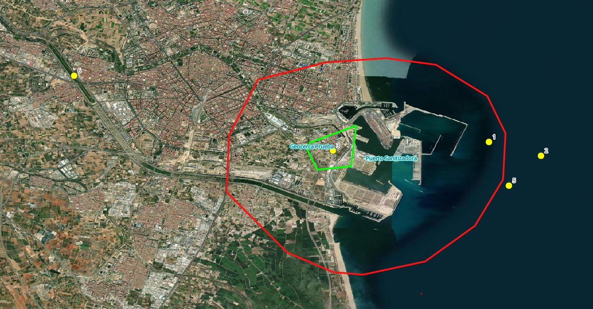
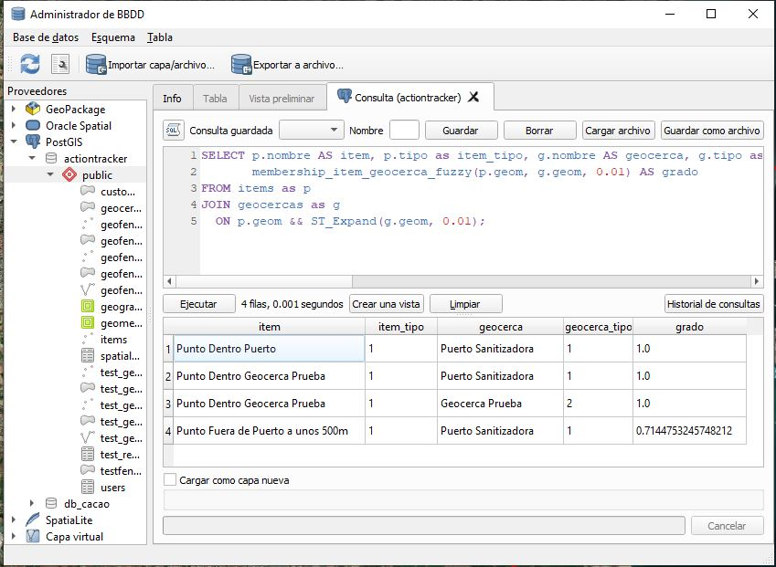
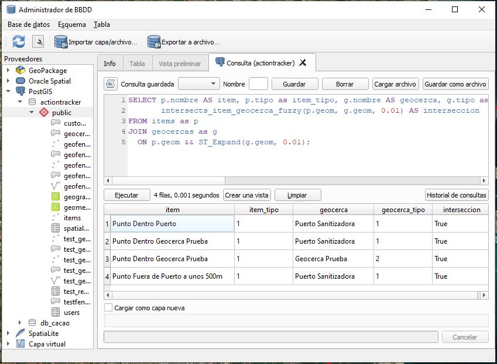

# Geocercas Sanitizadoras - Geofencing Difuso

Implementación piloto de  un sistema de geofencing difuso (fuzzy geofencing) para la gestión de geocercas sanitizadoras utilizando PostgreSQL+ PostGIS. El sistema permite evaluar la pertenencia de puntos a geocercas con tolerancia, proporcionando tanto resultados booleanos como grados de pertenencia continuos.

## Descripción del Proyecto

El sistema de **Geocercas Sanitizadoras** implementa un enfoque de geofencing difuso que permite:

- **Geofencing Tradicional**: Detección exacta de puntos dentro de polígonos
- **Geofencing Difuso**: Evaluación con tolerancia para casos límite
- **Grado de Pertenencia**: Valores continuos entre 0 y 1 que indican qué tan "cerca" está un punto de una geocerca

Este enfoque es especialmente útil para aplicaciones donde se necesita flexibilidad en la detección de proximidad, como sistemas de sanitización, monitoreo de vehículos, o aplicaciones de logística.

## Características Principales

- **Dos tipos de geocercas**: Sanitizadoras (tipo 1) y normales (tipo 2)
- **Funciones de intersección difusa**: Evaluación booleana con tolerancia
- **Funciones de grado de pertenencia**: Valores continuos de 0 a 1
- **Índices espaciales optimizados**: Para consultas rápidas con GIST
- **Datos de prueba**: Incluye ejemplos reales para testing
- **Sistema de logging**: Notificaciones detalladas de las evaluaciones

## Estructura de la Base de Datos

### Tabla `geocercas`
```sql
CREATE TABLE geocercas (
    id SERIAL PRIMARY KEY,
    nombre TEXT,
    tipo integer,  -- 1: sanitizadora, 2: normal
    geom geometry(Polygon, 4326)
);
```

### Tabla `items`
```sql
CREATE TABLE items (
    id SERIAL PRIMARY KEY,
    nombre TEXT,
    tipo integer,
    geom geometry(Point, 4326)
);
```

### Índices Espaciales
El sistema incluye índices GIST optimizados para consultas espaciales rápidas:
```sql
CREATE INDEX idx_geocercas_geom ON geocercas USING GIST (geom);
CREATE INDEX idx_items_geom ON items USING GIST (geom);
```

### Tipos de Geocercas
- **Tipo 1**: Geocerca sanitizadora
- **Tipo 2**: Geocerca normal

## Instalación y Configuración

### Prerrequisitos
- PostgreSQL 12+
- Extensión PostGIS instalada

### Pasos de Instalación

1. **Crear la base de datos**:
```sql
CREATE DATABASE geocercas_db;
\c geocercas_db;
```

2. **Habilitar PostGIS**:
```sql
CREATE EXTENSION IF NOT EXISTS postgis;
```

3. **Ejecutar el script**:
```bash
psql -d geocercas_db -f geocercas_sanitizadoras.sql
```

### Verificación de la Instalación
```sql
-- Verificar que las tablas se crearon correctamente
\dt

-- Verificar los datos de prueba
SELECT COUNT(*) FROM geocercas;
SELECT COUNT(*) FROM items;
```

## Funciones Implementadas

### 1. `intersects_item_geocerca_fuzzy()`

**Propósito**: Determina si un punto intersecta con una geocerca considerando tolerancia.

**Parámetros**:
- `point_geom`: Geometría del punto
- `poly_geom`: Geometría del polígono
- `tolerance`: Tolerancia en grados (ej: 0.01 ≈ 1km)

**Retorna**: `boolean`

**Lógica**:
1. Si el punto está dentro del polígono → `TRUE`
2. Si el punto está dentro de la tolerancia → `TRUE`
3. En caso contrario → `FALSE`

### 2. `membership_item_geocerca_fuzzy()`

**Propósito**: Calcula el grado de pertenencia de un punto a una geocerca.

**Parámetros**:
- `point_geom`: Geometría del punto
- `poly_geom`: Geometría del polígono
- `tolerance`: Tolerancia en grados

**Retorna**: `double precision` (0.0 - 1.0)

**Lógica**:
1. Si el punto está dentro del polígono → `1.0`
2. Si está dentro de la tolerancia → `1 - (distancia / tolerancia)`
3. Si está fuera de la tolerancia → `0.0`

##  Ejemplos de Uso

### Consulta de Intersección Difusa
```sql
SELECT 
    p.nombre AS item, 
    p.tipo as item_tipo, 
    g.nombre AS geocerca, 
    g.tipo as geocerca_tipo,
    intersects_item_geocerca_fuzzy(p.geom, g.geom, 0.01) AS interseccion
FROM items as p
JOIN geocercas as g ON p.geom && ST_Expand(g.geom, 0.01);
```

### Consulta de Grado de Pertenencia
```sql
SELECT 
    p.nombre AS item, 
    p.tipo as item_tipo, 
    g.nombre AS geocerca, 
    g.tipo as geocerca_tipo,
    membership_item_geocerca_fuzzy(p.geom, g.geom, 0.01) AS grado
FROM items as p
JOIN geocercas as g ON p.geom && ST_Expand(g.geom, 0.01);
```

### Consulta Específica para Geocercas Sanitizadoras
```sql
SELECT 
    p.nombre,
    g.nombre as geocerca_sanitizadora,
    membership_item_geocerca_fuzzy(p.geom, g.geom, 0.01) as grado_pertenencia
FROM items p
CROSS JOIN geocercas g
WHERE g.tipo = 1  -- Solo geocercas sanitizadoras
  AND membership_item_geocerca_fuzzy(p.geom, g.geom, 0.01) > 0;
```

## Consultas de Prueba

El script incluye datos de prueba con diferentes escenarios:

### Puntos de Prueba
- **Punto Dentro Puerto**: Dentro de la geocerca sanitizadora
- **Punto Fuera Puerto**: A ~1km fuera del puerto
- **Punto Dentro Geocerca Prueba**: Dentro de la geocerca normal
- **Punto Lejano**: Muy lejos de cualquier geocerca
- **Punto a 500m**: Cerca del límite de tolerancia
- **Punto a 5km**: Fuera del rango de tolerancia

### Ejecutar Pruebas
```sql
-- Ejecutar las consultas de prueba incluidas en el script
-- Las consultas están al final del archivo geocercas_sanitizadoras.sql
```

### Captura de Pantalla del Ejemplo

*Interfaz o visualización del sistema en funcionamiento*

### Visualización del Grado Difuso

*Representación visual del concepto de grado difuso en geofencing*

### Intersección Difusa

*Diagrama explicativo de la intersección difusa con tolerancia*


